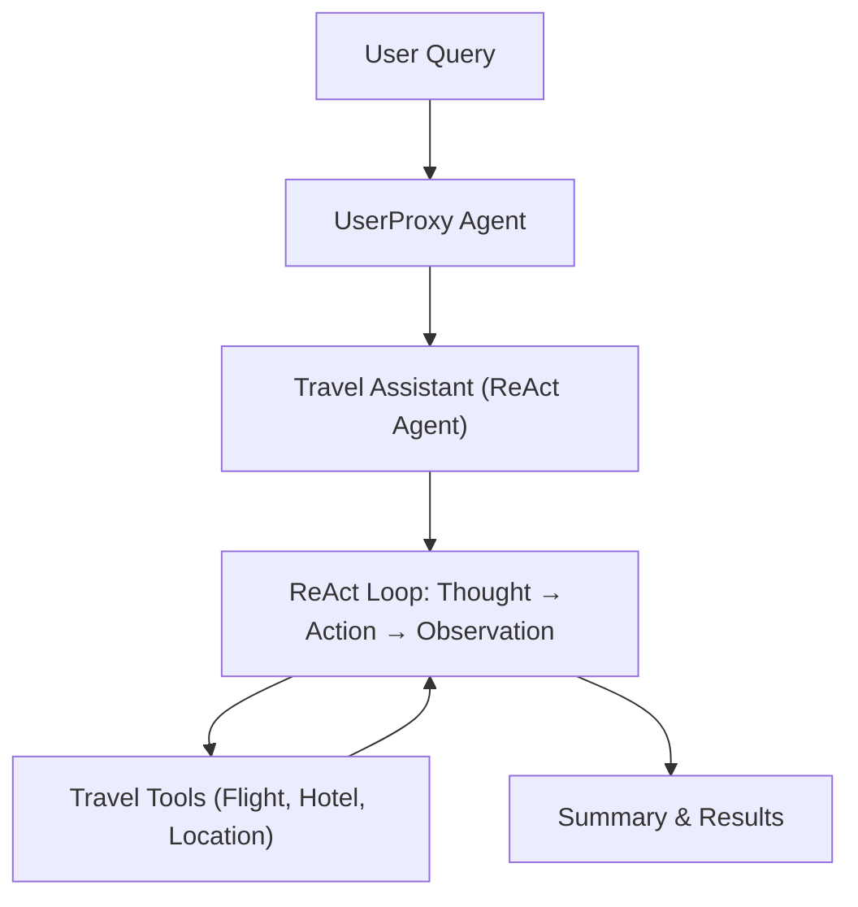

# Agentic ReAct Pattern: Travel Agent Demo

A Streamlit-based demonstration of the ReAct Pattern in agentic workflows, where an AI travel assistant plans and books trips by reasoning, acting (using tools), and observing results in a loop. Powered by AutoGen, Ollama, and local LLMs.

---

## Features
- Implements the ReAct pattern: Thought → Action → Observation cycles
- Travel Assistant agent plans and books trips using available tools
- Tools for flight status, price tracking, hotel details, and location info
- Interactive Streamlit UI for entering travel requests and viewing agent reasoning

---

## Architecture Diagram



---

## Requirements
- Python 3.8+
- [streamlit](https://streamlit.io/)
- [autogen](https://github.com/microsoft/autogen)
- [ollama](https://ollama.com/) (for local LLMs)
- [python-dotenv](https://pypi.org/project/python-dotenv/)

Install dependencies:
```bash
pip install streamlit python-dotenv autogen
```

---

## Usage

1. Ensure Ollama is running locally and supports the required models (e.g., llama3.2).
2. Set your `OPENAI_API_KEY` environment variable (if needed).
3. Run the app:
   ```bash
   streamlit run planning_react_streamlit.py
   ```
4. Enter a travel-related request (e.g., "Plan a trip to NYC: need flight AA123 status, hotel for next week, and local events. Find the cheapest time to fly from SFO to NYC next month and suggest a hotel.")
5. View the agent's reasoning, tool use, and summary of your travel request.

---

## Notes
- The system demonstrates the ReAct Pattern for agentic travel planning.
- The UI displays the agent's full reasoning and tool use history.

---

## License
MIT License
